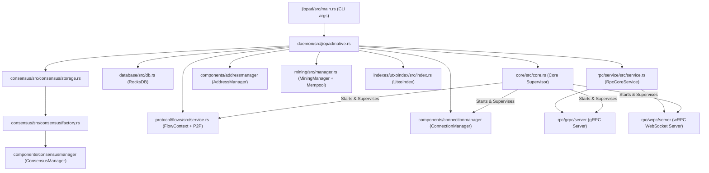

# rusty-jiopad: Module & File Implementation Blueprint

This document maps the exact repository directory structure of **`rusty-jio`** and details how each crate, module, and file is connected together to run the **`jiopad`** full node, modeled directly on the **`rusty-kaspa`** architecture.

---

## 1. System Dependency Layers (Build Order)

A crate may depend **only** on crates in strictly lower layers:

```
L0   math, utils, metrics
L1   crypto (hashes, addresses, merkle, muhash, txscript)
L2   core (async service framework), consensus/core (canonical types & ConsensusApi)
L3   database (RocksDB & CachedDbAccess), indexes (UtxoIndex)
L4   consensus/pow, consensus/notify, consensus (GHOSTDAG, Reachability, Pipeline)
L5   components (consensusmanager, connectionmanager, addressmanager), mining (mempool, block_template)
L6   notify, protocol (p2p, flows)
L7   rpc (core, service, grpc, wrpc)
L8   daemon, jiopad (node binary)
L9   wallet, cli, rothschild, simpa
L10  wasm
```

---

## 2. Boot & Execution Flow: How Components Wire to Run `jiopad`



### Runtime Sequence
1. **Entry Point** (`jiopad/src/main.rs`): Parses CLI arguments (network type, data dir, RPC flags, listen ports) via `args.rs` and calls `daemon::jiopad::native::main()`.
2. **Supervisor Initialization** (`core/src/core.rs`): Instantiates `Core`, configures logging (`core/src/log/`), installs OS signal handlers (`core/src/signals.rs`), and initializes the Tokio runtime (`core/src/task/runtime.rs`).
3. **Storage Engine** (`database/src/db.rs`): Opens RocksDB at `~/.jiopad/<network>` with optimized bloom filters and cache policies (`database/src/cache.rs`).
4. **Consensus Assembly** (`consensus/src/consensus/`):
   - `storage.rs`: Mounts all database stores (headers, ghostdag, reachability, relations, virtual_state, utxo_set).
   - `services.rs`: Instantiates `ReachabilityService`, `GhostdagManager`, `HeaderProcessor`, `BodyProcessor`, `VirtualProcessor`, and `PruningProcessor`.
   - `factory.rs`: Packages the pipeline into a `Consensus` instance implementing `ConsensusApi`.
5. **Component Managers**:
   - `components/consensusmanager`: Wraps active consensus in an `ArcSwap` session holder to allow parallel lock-free reading and atomic consensus swapping during Initial Block Download (IBD).
   - `components/addressmanager`: Loads peer IP:port routing table and bans bad nodes.
   - `components/connectionmanager`: Manages target outbound peer count and connection backoffs.
6. **Mempool & Mining** (`mining/src/manager.rs`):
   - Initializes `MiningManager` with consensus access and mempool settings.
   - Holds the priority frontier search tree (`mining/src/mempool/model/frontier/search_tree.rs`) for greedy block filling.
7. **Secondary Indexing** (`indexes/utxoindex/`):
   - If `--utxoindex` is passed, instantiates `UtxoIndex` and registers it to receive consensus `UtxoDiff` notifications.
8. **P2P Networking** (`protocol/p2p/` & `protocol/flows/`):
   - Instantiates `FlowContext` containing references to ConsensusManager, AddressManager, and MiningManager.
   - Starts `P2pAdaptor` listening for incoming gRPC/Tonic connections.
   - Spawns peer flows: `blockrelay`, `txrelay`, `ping`, and `ibd` (Initial Block Download).
9. **RPC Subsystem** (`rpc/`):
   - Instantiates `RpcCoreService` (`rpc/service/`) combining ConsensusManager, MiningManager, UtxoIndex, and ConnectionManager.
   - Starts `GrpcServer` (`rpc/grpc/server/`) for gRPC clients.
   - Starts `WrpcServer` (`rpc/wrpc/server/`) for WebSockets (JSON and Borsh protocols).
10. **Service Registration & Join**:
    - All services implementing `AsyncService` (`core/src/service.rs`) are bound to `Core`.
    - `core.start()` triggers async workers; `core.join()` waits until SIGINT/SIGTERM initiates an orderly shutdown.

---

## 3. Crate-by-Crate & File-by-File Blueprint

### 3.1 `core/` (L2: Async Application Framework)
`core` provides the service framework, logging, and runtime primitives used across the entire node.

| File | Purpose / Responsibility |
| --- | --- |
| `src/lib.rs` | Re-exports core modules |
| `src/core.rs` | Central `Core` supervisor struct managing the collection of `AsyncService` instances |
| `src/service.rs` | `AsyncService` trait (`ident()`, `start()`, `stop()`) |
| `src/signals.rs` | OS signal listener (`SIGINT`, `SIGTERM`, `SIGHUP`) notifying cancellation tokens |
| `src/assert.rs` | Debug and invariant assertions |
| `src/console.rs` | Terminal output formatting and colors |
| `src/panic.rs` | Global panic handler restoring terminal state and dumping backtraces to log files |
| `src/time.rs` | High-precision monotonic and unix timestamps |
| `src/jiopad_env.rs` | Environment variable resolvers (`JIOPAD_DATA_DIR`, `JIOPAD_LOG_LEVEL`) |
| `src/log/logger.rs` | Structured logging initialization |
| `src/log/appender.rs` | Rotating file appender and stdout appender |
| `src/log/consts.rs` | Default log formatting constants |
| `src/task/runtime.rs` | Tokio runtime builder with thread pool tuning |
| `src/task/service.rs` | Managed async task execution with panic recovery |
| `src/task/tick.rs` | Async periodic ticker for background maintenance loops |

---

### 3.2 `math/`, `utils/`, `metrics/` (L0: Foundations)
#### `math/`
| File | Responsibility |
| --- | --- |
| `src/lib.rs` | Re-exports |
| `src/uint.rs` | `U192`, `U256`, `U512` fixed-width big integers for difficulty and target calculations |
| `src/int.rs` | Signed integer helpers |
| `src/wasm.rs` | WebAssembly math bindings |

#### `utils/`
| File | Responsibility |
| --- | --- |
| `src/hex.rs` | Hex string encoding/decoding traits (`ToHex`, `FromHex`) |
| `src/mem_size.rs` | Heap memory consumption estimation for in-memory caches |
| `src/sysinfo.rs` | Real-time RAM, CPU, and disk metrics collection |
| `src/triggers.rs` | Async execution triggers (`SingleTrigger`, `DuplexTrigger`) |
| `src/channel.rs` | Bounded and unbounded channel wrappers |
| `src/networking.rs` | IP address classification (routable, private, loopback) |
| `src/sync/rwlock.rs` | Deadlock-detecting RwLock wrappers |
| `src/sync/semaphore.rs` | Fair async semaphore |
| `src/alloc/lib.rs` | Memory allocator configuration (Jemalloc / Mimalloc) |

#### `metrics/`
| Module | Responsibility |
| --- | --- |
| `core/src/data.rs` | Snapshot structs for TPS, BPS, DAG tips, and memory consumption |
| `perf_monitor/src/` | Sampling thread for periodic process performance metrics |

---

### 3.3 `crypto/` (L1: Cryptography)
| Sub-crate / File | Responsibility |
| --- | --- |
| `hashes/src/hashers.rs` | Domain-separated BLAKE3 hashers (`BlockHash`, `TxHash`, `HeaderHash`) |
| `hashes/src/pow_hashers.rs` | Proof-of-work heavy-hash hasher (cSHAKE + matrix multiply) |
| `hashes/src/keccakf1600_*.s` | Optimized assembly for Keccak permutation |
| `addresses/src/bech32.rs` | Bech32 checksum encoding/decoding with BCH error detection |
| `addresses/src/lib.rs` | `Address` struct with prefixes (`jio`, `jiotest`, `jiosim`, `jiodev`) |
| `merkle/src/lib.rs` | Merkle root calculation for transactions and accepted block IDs |
| `muhash/src/u3072.rs` | 3072-bit group arithmetic for incremental UTXO set multi-set hashing |
| `txscript/src/script_builder.rs` | Script generation for P2PK and multisig outputs |
| `txscript/src/script_class.rs` | Script classifier (`PubKey`, `ScriptHash`, `NonStandard`) |
| `txscript/src/data_stack.rs` | Stack machine for opcode evaluation |
| `txscript/src/opcodes/macros.rs` | Opcode definitions (`OP_CHECKSIG`, `OP_EQUALVERIFY`, etc.) |

---

### 3.4 `consensus/core/` (L2: Canonical Types & Traits)
Crate: `jio-consensus-core`
| File | Responsibility |
| --- | --- |
| `src/block.rs` | `Block` and `BlockTemplate` structures |
| `src/header.rs` | `Header` structure (parents, bits, nonce, daa_score, blue_work, blue_score, pruning_point) |
| `src/tx.rs` | `Transaction`, `TxInput`, `TxOutput`, `TransactionOutpoint`, `UtxoEntry` |
| `src/coinbase.rs` | `CoinbaseData` payload format and script extranonce |
| `src/acceptance_data.rs` | `AcceptanceData` recording transaction acceptance per block |
| `src/utxo/utxo_collection.rs` | HashMap-based UTXO collection |
| `src/utxo/utxo_diff.rs` | `UtxoDiff` representing atomic additions and deletions to the UTXO set |
| `src/utxo/utxo_view.rs` | Read-only UTXO query interface |
| `src/config/params.rs` | Consensus parameters (`Params`: BPS, DAA window, finality, $k$) |
| `src/config/genesis.rs` | Genesis block specification |
| `src/api/mod.rs` | **`ConsensusApi`** trait exposed by consensus to the rest of the node |

---

### 3.5 `database/` (L3: Storage Engine)
| File | Responsibility |
| --- | --- |
| `src/db.rs` | **`DB`** RocksDB database handle with column family management |
| `src/db/conn_builder.rs` | RocksDB option tuning (write buffers, bloom filters, block cache) |
| `src/registry.rs` | Prefix registry ensuring separate stores do not collide |
| `src/key.rs` | `DbKey` prefix-scoped key serializer |
| `src/access.rs` | **`CachedDbAccess<TKey, TData>`** providing LRU cache over RocksDB |
| `src/item.rs` | **`CachedDbItem<TData>`** for singleton values (tips, virtual state) |
| `src/writer.rs` | `DirectDbWriter` and atomic `BatchDbWriter` |
| `src/cache.rs` | Cache sizing policies (by count or byte budget) |

---

### 3.6 `consensus/` (L4: Main Consensus Engine)
Crate: `jio-consensus`

#### `src/consensus/` (Lifecycle & Wiring)
- `storage.rs`: **`ConsensusStorage`** instantiates all RocksDB stores.
- `services.rs`: **`ConsensusServices`** connects stores, processors, and algorithmic managers.
- `factory.rs`: **`ConsensusFactory`** creates consensus instances (initial startup and IBD swaps).
- `mod.rs`: **`Consensus`** implementing `ConsensusApi`.

#### `src/model/stores/` (State Stores)
- `headers.rs`: Block headers indexed by hash.
- `block_transactions.rs`: Full transaction bodies.
- `ghostdag.rs`: GHOSTDAG metadata per block (`blue_score`, `blue_work`, `selected_parent`, `mergeset_blues`, `mergeset_reds`).
- `reachability.rs`: Tree intervals for fast DAG reachability queries.
- `relations.rs`: Multi-level DAG parent/child relationships.
- `statuses.rs`: Block validation status (`StatusHeaderOnly`, `StatusUTXOValid`, etc.).
- `tips.rs`: Current DAG tips.
- `selected_chain.rs`: Chain of virtual selected parents.
- `utxo_set.rs` & `utxo_diffs.rs`: Multiset and diff stores.
- `pruning.rs` & `pruning_utxoset.rs`: Pruning point and past pruning points.
- `virtual_state.rs`: Virtual block state (accumulated DAA score, bits, tips, UTXO multiset).

#### `src/processes/` (Algorithms)
- `ghostdag/protocol.rs`: GHOSTDAG protocol: chooses the selected parent chain and computes blue/red mergesets using $k$.
- `reachability/tree.rs` & `interval.rs`: Maintains an interval tree over the DAG, enabling $O(1)$ ancestor queries (`is_dag_ancestor_of`).
- `difficulty.rs` & `window.rs`: Computes the DAA difficulty target over the sampled window.
- `past_median_time.rs`: Computes Past Median Time (PMT) ensuring monotonically increasing timestamps.
- `coinbase.rs`: Block subsidy halving calculation and coinbase transaction builder.
- `transaction_validator/`:
  - `tx_validation_in_isolation.rs`: Format, non-empty inputs/outputs, mass limits.
  - `tx_validation_not_utxo_related.rs`: Subnetwork permissions, lock times.
  - `transaction_validator_populated.rs`: Signature verification, input/output amounts, fees.

#### `src/pipeline/` (Block Processing Pipeline)
- `deps_manager.rs`: Async task scheduler managing block dependency waits.
- `header_processor/processor.rs`:
  - Validates PoW (`pre_pow_validation.rs`).
  - Validates timestamp against PMT (`pre_ghostdag_validation.rs`).
  - Computes GHOSTDAG and inserts header into reachability tree.
- `body_processor/processor.rs`:
  - Validates transaction merkle root against header (`body_validation_in_isolation.rs`).
  - Verifies coinbase payload rules.
  - Stores transaction body in database and hands off to virtual processor.
- `virtual_processor/mod.rs` & `utxo_validation.rs`:
  - Resolves DAG tips and selects new virtual selected parent.
  - Computes mergeset and applies UTXO additions/deletions (`UtxoDiff`).
  - Resolves double spends, rejecting conflicting transactions.
  - Commits new UTXO multiset to DB and emits events (`BlockAdded`, `VirtualSelectedParentChainChanged`).
- `pruning_processor/processor.rs`:
  - Advances pruning point when finality depth is reached.
  - Prunes historic block bodies beyond the pruning depth.

---

### 3.7 `components/` (L5: Subsystem Managers)
| Crate / File | Responsibility |
| --- | --- |
| `consensusmanager/src/lib.rs` | **`ConsensusManager`** holds `Arc<ArcSwap<Consensus>>`. Provides non-blocking concurrent `session()` reads and supports atomic consensus replacement during IBD |
| `consensusmanager/src/session.rs` | `ConsensusSession` guard managing reference counters |
| `connectionmanager/src/lib.rs` | **`ConnectionManager`** maintains target peer count, dials peers, applies exponential backoffs |
| `addressmanager/src/lib.rs` | **`AddressManager`** stores known peer IP:ports, bans abusive nodes, handles UPnP port forwarding |

---

### 3.8 `mining/` (L5: Mempool & Block Template)
Crate: `jio-mining`
| File | Responsibility |
| --- | --- |
| `src/manager.rs` | **`MiningManager`** orchestrating block template generation and mempool validation |
| `src/block_template/builder.rs` | Assembles candidate `BlockTemplate` |
| `src/block_template/selector.rs` | Greedy selection of highest feerate-per-mass transactions |
| `src/mempool/validate_and_insert_transaction.rs` | Validates transaction against current virtual UTXO set |
| `src/mempool/model/frontier/search_tree.rs` | Fee-rate indexed search tree for $O(\log n)$ transaction insertion and selection |
| `src/mempool/replace_by_fee.rs` | Replace-By-Fee (RBF) replacement rules |
| `src/mempool/handle_new_block_transactions.rs` | Evicts accepted transactions on new block and re-validates remaining mempool transactions |
| `src/mempool/orphan_pool.rs` | Manages transactions with missing unconfirmed parent inputs |

---

### 3.9 `notify/` & `indexes/` (L6 & L3: Notifications & Indexes)
#### `notify/`
| File | Responsibility |
| --- | --- |
| `src/notifier.rs` | Multi-subscriber event dispatcher |
| `src/subscription/compounded.rs` | Compounds multiple listener subscriptions into minimal upstream notifications |
| `src/address/tracker.rs` | Address-level transaction and UTXO filtering |
| `src/events.rs` | Event enum (`BlockAdded`, `VirtualChainChanged`, `UtxosChanged`) |

#### `indexes/`
| File | Responsibility |
| --- | --- |
| `utxoindex/src/index.rs` | **`UtxoIndex`** maps `ScriptPublicKey` to active UTXO sets and balance |
| `utxoindex/src/update_container.rs` | Consumes consensus `UtxoDiff` notifications and updates the index atomically |
| `utxoindex/src/stores/*.rs` | RocksDB storage for indexed UTXOs and circulating coin supply |

---

### 3.10 `protocol/` (L6: P2P Transport & Flows)
#### `protocol/p2p/`
| File | Responsibility |
| --- | --- |
| `proto/p2p.proto` | Protobuf wire protocol definitions |
| `src/core/adaptor.rs` | **`Adaptor`** managing incoming/outgoing Tonic gRPC connections |
| `src/core/router.rs` | Demultiplexes incoming wire messages by payload type into dedicated channels |
| `src/core/hub.rs` | Registry of all actively connected peers |
| `src/handshake.rs` | P2P handshake exchanging version, network ID (`jio-mainnet`, `jio-testnet`), and capabilities |

#### `protocol/flows/`
| File | Responsibility |
| --- | --- |
| `src/flow_context.rs` | **`FlowContext`** sharing state across all flows (ConsensusManager, AddressManager, MiningManager) |
| `src/service.rs` | **`P2pService`** registering and launching flow tasks for every connected peer |
| `src/v5/blockrelay/flow.rs` | Relays block inventory (`InvRelayBlock`), requests blocks, submits to consensus pipeline |
| `src/v5/txrelay/flow.rs` | Relays transaction inventory and submits valid incoming transactions to `MiningManager` |
| `src/v5/ibd/flow.rs` | **Initial Block Download (IBD)** orchestrator |
| `src/v5/ibd/negotiate.rs` | Negotiates highest shared block with peer |
| `src/v5/request_pp_proof.rs` | Downloads and validates pruning point proof |
| `src/v5/request_pruning_point_utxo_set.rs` | Downloads pruning point UTXO set into a staging consensus instance |
| `src/v5/ping.rs` | Heartbeat latency monitoring |

---

### 3.11 `rpc/` (L7: RPC Layer)
| Sub-crate / File | Responsibility |
| --- | --- |
| `core/src/api/rpc.rs` | **`RpcApi`** trait declaring all RPC methods (`submit_block`, `get_block_template`, etc.) |
| `service/src/service.rs` | **`RpcCoreService`** implementing `RpcApi` by coordinating consensus, mining, and indexes |
| `grpc/server/` | Protobuf gRPC server |
| `wrpc/server/` | WebSocket RPC server supporting both **Borsh** (high-speed binary) and **JSON** |

---

### 3.12 `daemon/` & `jiopad/` (L8: Node Assembly & Binary)
#### `daemon/`
| File | Responsibility |
| --- | --- |
| `src/jiopad/native.rs` | Core boot sequence: instantiates DB, Consensus, Mining, P2P, RPC, binds them to `Core`, and starts the node |
| `src/cpu_miner/native.rs` | Optional built-in CPU miner submitting blocks to consensus |

#### `jiopad/`
| File | Responsibility |
| --- | --- |
| `src/args.rs` | Clap command-line parser (`--testnet`, `--utxoindex`, `--rpclisten-borsh`, `--addpeer`) |
| `src/main.rs` | Binary entry point: configures runtime threads and invokes `daemon::jiopad::native::main()` |

---

### 3.13 Client Ecosystem & Utilities (L9 & L10)
- `wallet/`:
  - `bip32/`: BIP-39 mnemonic phrase to master seed and derivation paths (`m/44'/111111'/0'`).
  - `keys/`: Keypair generation, Schnorr signing, xpub/xprv serialization.
  - `core/`: High-level wallet engine, UTXO selection, fee estimation, multi-input transaction generation, encrypted JSON wallet file storage.
  - `pskt/`: Partially Signed Jio Transaction for multi-party and hardware wallet signing.
- `cli/`:
  - Interactive terminal CLI connecting to `jiopad` over wRPC. Commands for wallet, transactions, DAG inspection, and miner control.
- `simpa/`:
  - Discrete-event BlockDAG simulator for testing consensus and network delays without real PoW.
- `rothschild/`:
  - High-performance load generator sending spam transactions to benchmark node TPS.
- `wasm/`:
  - WebAssembly bindings for Node.js and web browsers.

---

## 4. Master Map of All 14 Execution Flows

The `jiopad` node is not a monolithic loop; it is a reactive, multi-actor system driven by **14 distinct, concurrent execution flows**:

```
┌────────────────────────────────────────────────────────────────────────────────────────┐
│                                 1. NODE LIFECYCLE FLOWS                               │
│  [Flow 1] Node Boot & Subsystem Wiring ────► [Flow 13] Graceful Shutdown Flow         │
└──────────────────────────────────────────┬─────────────────────────────────────────────┘
                                           │
┌──────────────────────────────────────────▼─────────────────────────────────────────────┐
│                               2. P2P & NETWORKING FLOWS                                │
│  [Flow 2] Peer Connection & Handshake ────► [Flow 3] Peer Discovery & Address Gossip   │
│  [Flow 4] Peer Liveness & Keep-Alive (Ping/Pong)                                       │
└──────────────────────────────────────────┬─────────────────────────────────────────────┘
                                           │
┌──────────────────────────────────────────▼─────────────────────────────────────────────┐
│                            3. SYNCHRONIZATION & CONSENSUS                              │
│  [Flow 7] Initial Block Download (IBD)  (Negotiate ─► Proof ─► UTXO Set Swap ─► Catchup)│
│  [Flow 5] Block Ingestion & Relay Flow  (Inv ─► Request ─► Process Queue)              │
│  [Flow 6] Four-Stage Consensus Pipeline (Header ─► Body ─► Virtual UTXO ─► Pruning)   │
└──────────────────────────────────────────┬─────────────────────────────────────────────┘
                                           │
┌──────────────────────────────────────────▼─────────────────────────────────────────────┐
│                             4. MEMPOOL & MINING FLOWS                                  │
│  [Flow 8] Transaction Ingestion, Mempool & RBF Validation                              │
│  [Flow 9] Block Template Assembly & Knapsack Selection                                 │
│  [Flow 10] Block Submission, Virtual Commit & Mempool Eviction                         │
└──────────────────────────────────────────┬─────────────────────────────────────────────┘
                                           │
┌──────────────────────────────────────────▼─────────────────────────────────────────────┐
│                        5. INDEXING, NOTIFICATIONS & CLIENTS                            │
│  [Flow 11] Secondary Indexing (UtxoIndex) & Compounded Notifications                   │
│  [Flow 12] RPC Request/Response & WebSocket Streaming (gRPC / wRPC)                    │
│  [Flow 14] Wallet Coin Selection, Multi-Input Signing & Broadcast                      │
└────────────────────────────────────────────────────────────────────────────────────────┘
```

### Flow 1: Node Boot & Subsystem Wiring
- **Trigger**: Process startup (`cargo run --bin jiopad`).
- **Path**: `jiopad/src/main.rs` -> `daemon/src/jiopad/native.rs` -> `core/src/core.rs` (logging, signals, runtime) -> `database/src/db.rs` -> `consensus/src/consensus/` (stores & pipeline) -> `components/consensusmanager` -> `components/addressmanager` -> `mining/src/manager.rs` -> `indexes/utxoindex/` -> `protocol/flows/src/flow_context.rs` -> `rpc/service/` -> `Core::start()`.

### Flow 2: Peer Connection & Handshake
- **Trigger**: Inbound TCP connect on port 16111 or outbound dial by `ConnectionManager`.
- **Path**: `protocol/p2p/src/core/adaptor.rs` -> `router.rs` -> `handshake.rs` (exchange `Version` and `Verack`, validate network ID and protocol version) -> Register in `hub.rs` -> `protocol/flows/src/service.rs` spawns per-peer flow loops.

### Flow 3: Peer Discovery & Address Gossip
- **Trigger**: Periodic timer in `v5/address.rs` or peer request.
- **Path**: Exchange `RequestAddresses` / `Addresses` wire messages -> filter unroutable/banned IPs -> update `AddressManager` store (`stores/address_store.rs`) -> UPnP port forwarding via `port_mapping_extender.rs`.

### Flow 4: Peer Liveness & Keep-Alive (Ping/Pong)
- **Trigger**: 2-minute ticker in `v5/ping.rs`.
- **Path**: Local node generates random nonce -> sends `PingMessage` -> peer returns `PongMessage` -> verify nonce, measure round-trip latency, penalize peer if timeout expires.

### Flow 5: Block Ingestion & Relay Flow
- **Trigger**: Peer sends `InvRelayBlock` wire announcement.
- **Path**: `protocol/flows/src/v5/blockrelay/flow.rs` checks if block is known -> if missing, sends `RequestRelayBlocks` -> receives `BlockMessage` -> enqueues into `process_queue.rs` -> submits to `ConsensusApi::validate_and_insert_block`.
- **Branches**: If parent missing, routes to `orphans.rs` and requests parents; if valid, propagates `InvRelayBlock` to other peers.

### Flow 6: Four-Stage Consensus Block Validation Pipeline
- **Trigger**: Block submitted from `ProcessQueue` or RPC `submit_block`.
- **Path**:
  1. `deps_manager.rs`: Ensures parent header stages are complete.
  2. `header_processor/processor.rs`: Validates PoW (`consensus/pow`), validates timestamp against PMT, runs GHOSTDAG (`ghostdag/protocol.rs`), registers into reachability interval tree (`reachability/tree.rs`), writes header store.
  3. `body_processor/processor.rs`: Validates transaction merkle root, verifies coinbase payload, checks transaction isolation rules, writes block transactions store.
  4. `virtual_processor/mod.rs`: Resolves tips, updates virtual selected parent, validates transactions against UTXO view (`utxo_validation.rs`), resolves double-spends, produces `UtxoDiff`, commits new UTXO multiset to `virtual_state` store, emits `BlockAdded` notification.
  5. `pruning_processor/processor.rs`: Advances pruning point past finality depth and prunes historic block bodies.

### Flow 7: Initial Block Download (IBD)
- **Trigger**: Handshake shows peer has higher blue score and greater blue work.
- **Path**: `v5/ibd/flow.rs` locks IBD mutex -> `negotiate.rs` finds highest common ancestor -> `request_pp_proof.rs` downloads & validates pruning point proof -> `request_pruning_point_utxo_set.rs` streams UTXO set into a *staging consensus* -> `ConsensusManager::swap_consensus()` atomically hot-swaps active consensus -> `request_headers.rs` streams headers -> `request_ibd_blocks.rs` streams blocks -> resumes normal block relay.

### Flow 8: Transaction Ingestion, Mempool & RBF Validation
- **Trigger**: P2P `InvTransactions` announcement or RPC `submit_transaction`.
- **Path**: `v5/txrelay/flow.rs` -> `mining/src/mempool/validate_and_insert_transaction.rs`:
  - `check_transaction_standard.rs`: dust rules, mass limits.
  - `populate_entries_and_try_validate.rs`: fetches UTXOs from consensus virtual view; checks missing parent inputs (routes to `orphan_pool.rs` if missing).
  - Script validation (`crypto/txscript`): checks Schnorr/ECDSA signatures.
  - Conflict checking: Replace-By-Fee (`replace_by_fee.rs`) requires higher fee and feerate.
  - Inserts transaction into `transactions_pool` and priority `frontier/search_tree.rs`.
  - Broadcasts `InvTransactions` to peer network.

### Flow 9: Block Template Assembly
- **Trigger**: Miner calls RPC `get_block_template`.
- **Path**: `rpc/service/` -> `MiningManager::build_block_template()` -> queries consensus for tips, DAA score, bits, timestamp -> `coinbase.rs` builds coinbase reward -> `block_template/selector.rs` greedily pulls highest fee-per-mass transactions from the mempool frontier search tree up to block mass limit -> returns `BlockTemplate`.

### Flow 10: Block Submission & Virtual Commit
- **Trigger**: Miner submits solved block via RPC `submit_block`.
- **Path**: Passes block to `ConsensusApi::validate_and_insert_block` -> executes Flow 6 (Pipeline) -> on virtual commit, `handle_new_block_transactions.rs` evicts confirmed transactions from mempool and re-validates remaining mempool transactions -> relays `InvRelayBlock` to P2P network.

### Flow 11: Secondary Indexing (UtxoIndex) & Event Notifications
- **Trigger**: VirtualProcessor commits block and produces `UtxoDiff`.
- **Path**: Dispatches `UtxoDiff` to `consensus/notify` -> `UtxoIndex::update()` writes added/removed UTXOs to RocksDB `indexed_utxos` store and updates circulating supply -> `notify/src/notifier.rs` matches `compounded.rs` listener filters and notifies subscribed address trackers (`tracker.rs`).

### Flow 12: RPC Request/Response & WebSocket Streaming
- **Trigger**: External client connection via gRPC (port 16110) or wRPC WebSocket (port 17110).
- **Path**: Decodes frame (Protobuf, Borsh, or JSON) -> dispatched to `RpcCoreService` facade -> calls ConsensusManager, MiningManager, or UtxoIndex -> formats and encodes response -> streams back over socket.

### Flow 13: Graceful Node Shutdown
- **Trigger**: `SIGINT` (Ctrl+C) or `SIGTERM`.
- **Path**: `signals.rs` triggers root cancellation token -> `Core::stop()` runs reverse-order shutdown:
  1. Closes external listeners (gRPC, wRPC, P2P adaptor).
  2. Disconnects peers in `Hub` and terminates protocol flows.
  3. Stops `ConnectionManager` and flushes `AddressManager` peer book to disk.
  4. Flushes mempool state.
  5. Waits for consensus pipeline stages to commit pending blocks.
  6. Flushes RocksDB write buffers and safely closes database.

### Flow 14: Wallet Transaction Generation & Signing
- **Trigger**: CLI command `wallet send` or WASM client request.
- **Path**: BIP-32 key derivation (`wallet/bip32`) -> fetches UTXOs via RPC `get_utxos_by_addresses` -> `Generator` performs coin selection, computes fees and mass, adds change output -> signs inputs with Schnorr signatures (`crypto/txscript`) -> submits signed transaction via RPC `submit_transaction`.

---

## 5. Execution Flow to Module Matrix

| Module / Crate | Participating Execution Flows |
| :--- | :--- |
| **`core`** | Flow 1 (Boot), Flow 13 (Shutdown) |
| **`math` & `crypto`** | Flow 6 (PoW/Sighash), Flow 8 (Tx Validation), Flow 14 (Signing) |
| **`database`** | Flow 1 (Open), Flow 6 (State Commit), Flow 7 (IBD Swap), Flow 13 (Flush) |
| **`consensus/core`** | Flow 1, 5, 6, 7, 8, 9, 10, 11 (Consensus Traits & Domain Types) |
| **`consensus` (pipeline)** | Flow 5 (Ingestion), Flow 6 (Validation), Flow 7 (IBD), Flow 10 (Commit) |
| **`components/consensusmanager`**| Flow 1 (Holder), Flow 6 (Session Read), Flow 7 (Atomic IBD Swap) |
| **`components/addressmanager`** | Flow 1 (Init), Flow 2 (Scores), Flow 3 (Gossip), Flow 4 (Penalties) |
| **`components/connectionmanager`**| Flow 1 (Init), Flow 2 (Dials), Flow 13 (Shutdown) |
| **`mining` (mempool/template)** | Flow 8 (Tx Admission/RBF), Flow 9 (Template), Flow 10 (Eviction) |
| **`protocol/p2p`** | Flow 1 (Listen), Flow 2 (Handshake/Router), Flow 4 (Ping), Flow 13 (Close) |
| **`protocol/flows`** | Flow 2 (Register), Flow 3 (Addr), Flow 5 (Block Relay), Flow 7 (IBD), Flow 8 (Tx Relay) |
| **`notify` & `indexes`** | Flow 11 (UtxoIndex Update & Compounded Event Dispatch) |
| **`rpc`** | Flow 1 (Server Start), Flow 9 (GetTemplate), Flow 10 (SubmitBlock), Flow 12 (Client RPC) |
| **`daemon` & `jiopad`** | Flow 1 (Boot Assembly), Flow 13 (Shutdown) |
| **`wallet` & `cli`** | Flow 12 (RPC interaction), Flow 14 (Transaction Generation & Signing) |

---

## 6. Implementation Checklist by Phase

- [ ] **Phase 1: Foundations & Lifecycle (Flows 1, 13)**
  - [ ] `math/uint.rs` (`U192`, `U256`, target math)
  - [ ] `crypto/hashes/hashers.rs` & `pow_hashers.rs`
  - [ ] `crypto/addresses/bech32.rs` (`jio` prefixes)
  - [ ] `core/src/core.rs`, `service.rs`, `signals.rs`, `log/`
  - [ ] `consensus/core/src/` (Block, Header, Tx, Genesis, Params, ConsensusApi)
- [ ] **Phase 2: Storage & Consensus Pipeline (Flow 6)**
  - [ ] `database/src/` (`DB`, `CachedDbAccess`, `BatchDbWriter`)
  - [ ] `consensus/src/model/stores/` (headers, ghostdag, reachability, utxo_set)
  - [ ] `consensus/src/processes/` (GHOSTDAG protocol, reachability tree, DAA window)
  - [ ] `consensus/pow/src/` (matrix heavy-hash)
  - [ ] `consensus/src/pipeline/header_processor/`
  - [ ] `consensus/src/pipeline/body_processor/`
  - [ ] `consensus/src/pipeline/virtual_processor/`
  - [ ] `consensus/src/consensus/` (`ConsensusFactory`, `ConsensusServices`, `ConsensusStorage`)
- [ ] **Phase 3: Components & P2P Transport (Flows 2, 3, 4)**
  - [ ] `components/consensusmanager/` (session management)
  - [ ] `components/addressmanager/` & `connectionmanager/`
  - [ ] `protocol/p2p/` (Protobuf definitions, Tonic gRPC adaptor, message router)
  - [ ] `protocol/flows/` (`FlowContext`, `ping.rs`, `address.rs`)
- [ ] **Phase 4: Block & Transaction Relay, Mempool (Flows 5, 8)**
  - [ ] `protocol/flows/src/v5/blockrelay/` (`ProcessQueue`, `OrphanPool`)
  - [ ] `mining/src/mempool/` (UTXO validation, frontier tree, RBF)
  - [ ] `protocol/flows/src/v5/txrelay/`
- [ ] **Phase 5: Initial Block Download (Flow 7)**
  - [ ] `protocol/flows/src/v5/ibd/` (`negotiate.rs`, `request_pp_proof.rs`, `request_pruning_point_utxo_set.rs`)
  - [ ] `components/consensusmanager/` (atomic consensus hot-swap)
- [ ] **Phase 6: Mining, Block Template & Submission (Flows 9, 10)**
  - [ ] `mining/src/block_template/` (candidate block builder, knapsack selection)
  - [ ] `mining/src/mempool/handle_new_block_transactions.rs` (eviction and re-validation)
- [ ] **Phase 7: RPC, Indexing & Wallet (Flows 11, 12, 14)**
  - [ ] `notify/` (compounded event notifications)
  - [ ] `indexes/utxoindex/` (UTXO index and balance tracking)
  - [ ] `rpc/core/` & `rpc/service/` (`RpcCoreService`)
  - [ ] `rpc/grpc/` & `rpc/wrpc/` (WebSocket server with Borsh and JSON)
  - [ ] `wallet/` (HD key derivation & transaction building)
  - [ ] `cli/` (interactive terminal client)

